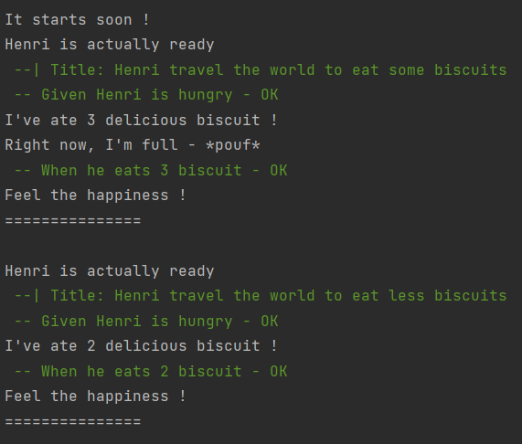
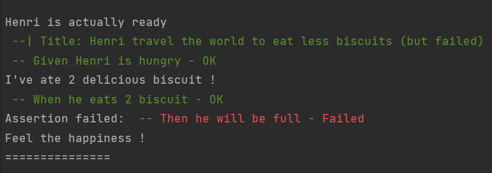

# custom-dsl
      
Minimalist cucumber-like to study how a Domain Specific Language works.
                                                                       
## Commands 
Run with `npm start`

Run test with `npm run test` (WIP - do nothing right now)
 
## Examples
Output examples :

_Everything going well_ 
  

_Something goes bad_ 
